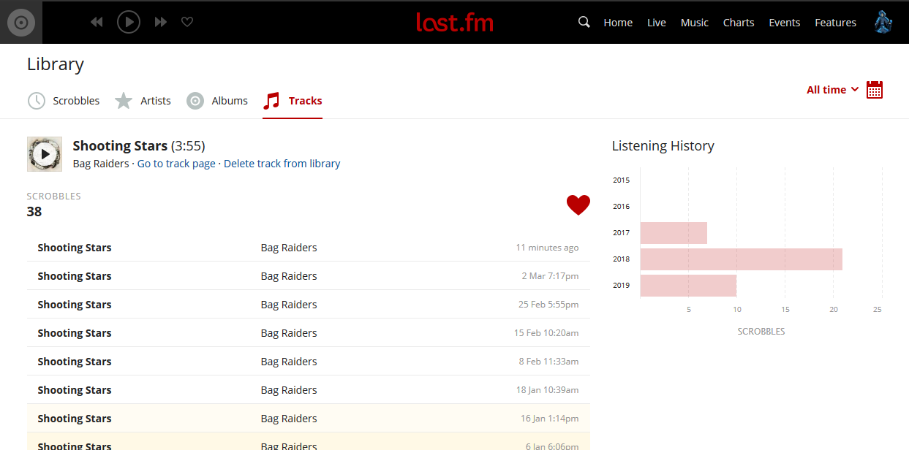

# lastfm-batch-edit

Edit all scrobbles in a list on [last.fm](https://www.last.fm)

## Installation

### Include manually

Copy code from [editScrobblesBatch.js](https://github.com/danielrw7/lastfm-batch-edit/blob/master/editScrobblesBatch.js) into console and hit enter

### Include automatically with [Greasemonkey](https://github.com/greasemonkey/greasemonkey)/[Tampermonkey](https://github.com/Tampermonkey/tampermonkey)

After installing Greasemonkey/Tampermonkey extension, click on
[Userscript Link](https://github.com/danielrw7/lastfm-batch-edit/raw/master/editScrobblesBatch.user.js)

## Usage

1. Navigate to the list of scrobbles you want to edit
2. Click "Edit scrobble" 
3. Edit the scrobble to the attributes you want for all scrobbles on the page
4. Click "Apply To All" 
5. Check the attributes in the confirm box and click "Ok" if everything looks correct
6. Wait until you get the "Batch edit completed!" alert. The script will go through each page in reverse order (e.g. 3, 2, 1)
7. Enjoy your edited scrobbles :) 
